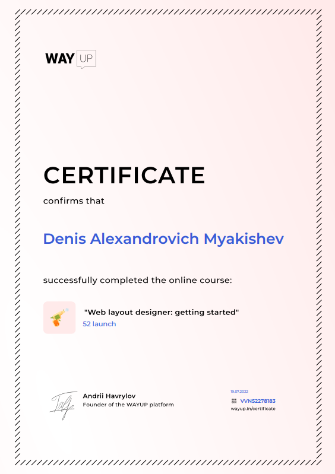

# Denis Myakishev
# Contact with me
* __Phone:__ +375291067967;
* __Mail:__ denmyakishev@mail.ru;
* __Discord:__ LAMPO4KA#6059.
====
# About me
I wanna to be a built IT specialist in the field of Web development. I like to write code and deal with interesting tasks . I love learning and know how to work in a team. Previously, I worked for a web page creating company for two months.
====
# What I know
I know the basics of: 
*__HTML__; 
*__CSS__;
*__JS__.
Also work with __Git__ version control system. 
Studied for a while:
*__Bootstrap 5__;
*__Vue.js__.
====
# My code example
```
function likes(names) {
  if(names.length === 0)
  {
    return "no one likes this";
  }
  else if(names.length === 1)
  {
    return names[0] + " likes this";
  } 
  else if(names.length === 2)
  {   
    return names[0] + " and " + names[1] + " like this";
  }
  else if(names.length === 3){
    return names[0] + ", " + names[1] + " and " + names[2] + " like this";
  } 
  else{
    return names[0] + ", " + names[1] + " and " + (names.length - 2) + " others like this";
  }
}
```
# Work experience
* [__Example of portfolio layout__](https://lamp4kad.github.io/portfolio/)

# Education
* Now I am studying at the Bobruisk State Forestry College
* 

# English
* Russian - native;
* English - A2;
* Belarus - native; 